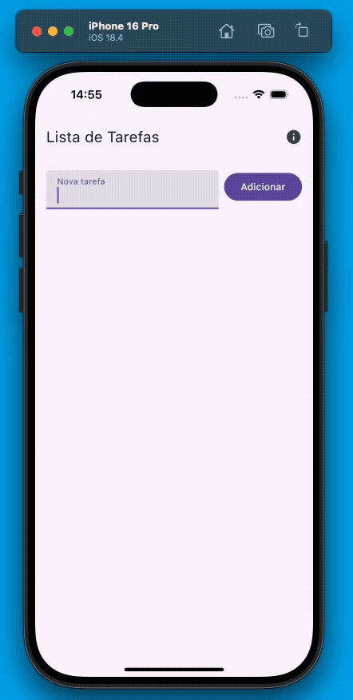
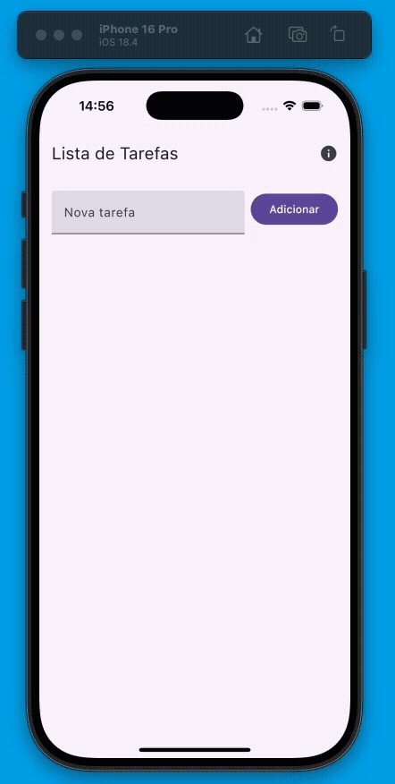

## **Injeção de Dependências com Koin no Kotlin Multiplatform (KMP)**

### **1\. Introdução**

Quando falamos em **Kotlin Multiplatform (KMP)**, um dos desafios é organizar o código de forma que possamos compartilhar lógica entre diferentes plataformas (Android, iOS).  
Nesse cenário, o uso de **Injeção de Dependência (DI)** ajuda a manter o projeto escalável, testável e limpo.

Neste artigo, vou mostrar como utilizei o **Koin** em um app simples de **lista de tarefas**, desenvolvido em KMP, para gerenciar dependências como repositórios, use cases e viewmodels.

---

### **2\. O que é Injeção de Dependência?**

Explicar de forma simples:

* Injeção de Dependência é um padrão de projeto que delega a criação das dependências para um componente externo, em vez de a própria classe instanciá-las. Isso aplica o princípio da Inversão de Dependência, garantindo que módulos dependam de abstrações e não de implementações concretas.

* Benefícios:

  * 🔹 **Desacoplamento**: classes conhecem interfaces/abstrações, não implementações concretas.
  * 🔹 **Testabilidade**: fica fácil trocar uma implementação real por um mock/fake nos testes.
  * 🔹 **Composição centralizada**: criação e configuração de objetos fica em um único lugar (modules).
  * 🔹 **Reuso e manutenção**: mudar implementações (ex: trocar cliente HTTP) sem mexer no código consumidor.
  * 🔹 **Gerência de ciclo de vida**: o container controla singletons, factories e escopos
    * **Singleton** → uma instância global criada apenas uma vez.
    * **Factory** → uma nova instância a cada uso.
    * **Scoped** → uma instância por ciclo de vida específico (sessão, activity, etc.).

---

### 

### **3\. Como o koin funciona?**

#### 1\) Módulos e definições (o “grafo”)

* **Módulo** (`module {...}`) é onde você declara *definitions*: `single {...}`, `factory {...}`, `scoped {...}`, `viewModel {...}` etc.

* Cada definição descreve **como construir** um tipo/serviço. O Koin constrói o grafo lendo os módulos na inicialização.

* Dentro das definições você pode usar `get()` para resolver outras dependências declaradas no grafo. [Insert Koin+1](https://insert-koin.io/docs/reference/koin-core/definitions/?utm_source=chatgpt.com)

Exemplo :

| val *appModule* \= *module* {    single\<TaskRepository\> { TaskRepositoryImpl() }    *viewModel*\<TaskViewModel\> {       TaskViewModel(repository \= get\<TaskRepository\>())    } } |
| :---- |

#### 2\) Inicialização: `startKoin` / `KoinApplication` / GlobalContext

* No Android, a forma mais comum de inicializar o Koin é dentro da classe que estende `Application`. Assim, o container de DI é configurado logo no início do ciclo de vida do app e fica disponível em toda a aplicação.

Exemplo:

| class TaskApp : Application() {    override fun onCreate() {        super.onCreate()        *startKoin* {            *androidContext*(this@TaskApp)            modules(*appModule*)        }    } } |
| :---- |

🔹 **O que acontece aqui**

* startKoin{...} inicializa o container de DI(Dependecy Injection) e registra no **GlobalContext**.

* androidContext(this@TaskApp) esta linha  informa ao Koin qual é o **Context global da aplicação Android**.  
  Com isso, o Koin pode injetar automaticamente qualquer recurso que dependa do Android Framework, como:
* **SharedPreferences** ou bancos locais que precisam de um Context para serem inicializados.
* **Recursos do sistema** (ex.: ConnectivityManager, NotificationManager).
* **Integração com ViewModel do AndroidX**, já que o Koin precisa conhecer o ciclo de vida e o contexto do app.

  Em resumo: sem essa linha, o Koin conheceria apenas os módulos puros de Kotlin. Ao passar o androidContext, você conecta o container de DI ao **ambiente Android**, liberando o uso das extensões específicas (androidModule, viewModel { ... }, injeção de classes do Android etc.).

* modules(appModule) carrega as definições de dependências que você declarou no módulo appModule.

Depois da inicialização, qualquer classe que implemente `KoinComponent` pode usar:

| val repo: TaskRepository by inject() |
| :---- |

ou diretamente:

| val repo \= *get*\<TaskRepository\>() |
| :---- |

🔹 **Por que dentro da Application?**

* A classe Application é criada antes de qualquer Activity ou Service.

* Isso garante que todas as dependências estejam disponíveis desde o primeiro momento em que o app começar a rodar.

* Depois da inicialização, qualquer parte da aplicação pode usar get() ou by inject() para recuperar dependências do Koin.

🔹 **Alternativa: contextos isolados com `KoinApplication`**

Normalmente, quando você chama `startKoin { ... }`, o Koin cria um **contexto global** de injeção de dependências (`GlobalContext`). Isso funciona bem para apps comuns, mas em alguns cenários você pode precisar **evitar esse contexto global**:

* **Bibliotecas/SDKs**: se sua lib usa Koin internamente, não é uma boa prática registrar módulos direto no contexto global do app, pois pode gerar conflitos de nomes/tipos com o app principal.

* **Múltiplos contextos separados**: em casos mais avançados, você pode querer rodar dois contêineres de DI(*dependency injection*) distintos (ex.: testar dois ambientes diferentes, “mock” vs “real”, ou isolar dependências de um módulo específico).

Nesses casos, em vez de usar `startKoin`, você pode criar um **contexto local** com `koinApplication { ... }`.

Exemplo:

val customKoin \= koinApplication **{**

modules(libraryModule)

**}**

val service \= customKoin.koin.*get*\<MyService\>()

Aqui:

* `koinApplication { ... }` cria uma instância **independente** de `KoinApplication`.
* Você acessa as dependências usando `customKoin.koin.get<T>()` em vez de `get()` global.
* Esse contêiner não interfere no `startKoin` do app principal — ou seja, app e lib podem coexistir sem conflitos.

#### 3\) E como seria a injeção de dependencia do repository como singleton na mão, sem o uso de frameworks?

object ServiceLocator {  
// Singleton manual  
val taskRepository: TaskRepository by *lazy* **{**  
TaskRepositoryImpl()  
**}**

fun provideTaskViewModel(): TaskViewModel {  
return TaskViewModel(repository \= taskRepository)  
}  
}

Uso:

val *viewModel* \= ServiceLocator.provideTaskViewModel()

🔹 Explicação

* `ServiceLocator` funciona como um **mini container** criado por você.
* `by lazy` garante que `TaskRepositoryImpl()` só será instanciado uma vez (parecido com o `single` do Koin).
* Quando precisar de um `TaskViewModel`, você chama `provideTaskViewModel()`, que passa o `repository` correto.

| Com koin | Sem koin |
| :---- | :---- |
| single { TaskRepositoryImpl() } | `val taskRepository = TaskRepositoryImpl()` (ou `by lazy`) |
| viewModel { TaskViewModel(get()) } | fun provideTaskViewModel() \= TaskViewModel(taskRepository) |
| Usa `get()` para resolver dependências | Você mesmo passa o construtor (`TaskViewModel(repository)`) |
| Container gerenciado pelo Koin | Container/ServiceLocator feito à mão |

#### 4\) E como seria a injeção de dependencia do repository como factory na mão, sem o uso de frameworks?

Com Koin (factory)

val appModule \= module **{**  
factory\<TaskRepository\> **{** TaskRepositoryImpl() **}**  
viewModel **{** TaskViewModel(repository \= *get*()) **}**  
**}**

`Aqui, sempre que um TaskViewModel for criado, ele recebe um TaskRepositoryImpl novo.`

Sem Koin — injeção manual (factory)

Se você quisesse imitar esse comportamento **sem Koin**, teria que escrever algo como:

object ServiceLocator {  
// Factory manual: cria um novo a cada chamada  
fun provideTaskRepository(): TaskRepository {  
return TaskRepositoryImpl()  
}

fun provideTaskViewModel(): TaskViewModel {  
// Repara que aqui chamamos provideTaskRepository()  
// \=\> ou seja, cada ViewModel terá um repository diferente  
return TaskViewModel(repository \= provideTaskRepository())  
}  
}

Uso:

val *vm1* \= ServiceLocator.provideTaskViewModel()  
val *vm2* \= ServiceLocator.provideTaskViewModel()

// vm1.repository \!= vm2.repository (são instâncias diferentes)

| `Tipo` | `Koin` | `Manual` | `Comportamento` |
| :---- | :---- | :---- | :---- |
| `single` | `single { TaskRepositoryImpl() }` | `val taskRepository by lazy { TaskRepositoryImpl() }` | `Uma única instância em todo o app (singleton).` |
| `factory` | `factory { TaskRepositoryImpl() }` | `fun provideTaskRepository() = TaskRepositoryImpl()` | `Uma nova instância a cada chamada` |

#### 5\) Qual é a principal diferença prática entre factory, single e scoped ?

🔹 1\. factory  

🔹 2\. single  

#### 6\) Como seria a criação de testes unitários com Koin ?

🔹 1\. Código de produção (com Koin)

// Repository real  
interface TaskRepository {  
fun getTasks(): List\<String\>  
}

class TaskRepositoryImpl : TaskRepository {  
override fun getTasks() \= *listOf*("Comprar pão", "Estudar KMP")  
}

// ViewModel que depende do Repository  
class TaskViewModel(private val repository: TaskRepository) {  
fun loadTasks() \= repository.getTasks()  
}

// Módulo de produção  
val *appModule* \= *module* **{**  
single\<TaskRepository\> **{** TaskRepositoryImpl() **}**  
factory **{** TaskViewModel(get()) **}**  
**}**  
🔹 2\. Teste sem Koin (injeção manual)

Se você não tivesse Koin, teria que **criar manualmente o ViewModel com uma fake/mock**

class FakeTaskRepository : TaskRepository {

override fun getTasks() \= *listOf*("Tarefa falsa 1", "Tarefa falsa 2")

}

@Test

fun \`loadTasks deve retornar lista fake\`() {

val fakeRepository \= FakeTaskRepository()

val viewModel \= TaskViewModel(fakeRepository)

val result \= viewModel.loadTasks()

assertEquals(*listOf*("Tarefa falsa 1", "Tarefa falsa 2"), result)

}

🔹 3\. Teste com Koin (muito mais limpo)

Com Koin, você pode **sobrescrever os módulos reais** dentro do teste:

class TaskViewModelTest : KoinTest {

// Módulo de teste (substitui o real)

private val testModule \= *module*(override \= true) **{**

       single\<TaskRepository\> **{** FakeTaskRepository() **}**

**}**

@Before

fun setup() {

       startKoin **{**

           modules(testModule) // só usamos o módulo fake

       **}**

}

@After

fun teardown() {

       stopKoin()

}

@Test

fun \`loadTasks deve retornar lista fake\`() {

       val viewModel: TaskViewModel by inject()

       val result \= viewModel.loadTasks()

       assertEquals(*listOf*("Tarefa falsa 1", "Tarefa falsa 2"), result)

}

}

### **4\. Como seria na prática com KMP?**

#### 1\) Configuração

*libs.versions.toml*  
\[versions\]  
koin \= "4.1.1"

\[libraries\]  
koin-core \= { module \= "io.insert-koin:koin-core", version.ref \= "koin" }  
koin-android \= { module \= "io.insert-koin:koin-android", version.ref \= "koin" }  
koin-androidx-compose \= { module \= "io.insert-koin:koin-androidx-compose", version.ref \= "koin" }

#### 2\) Conceito simples (Kotlin)

interface TaskRepository {

suspend fun add(todo: Task)

suspend fun remove(id: String)

suspend fun all(): List\<Task\>

}

class TaskRepositoryImpl : TaskRepository {

private val items \= *mutableListOf*\<Task\>()

override suspend fun add(todo: Task) { items.add(todo) }

override suspend fun remove(id: String) { items.*removeAll* **{ it**.id \== id **}** }

override suspend fun all(): List\<Task\> \= items.*toList*()

}

val *appModule* \= *module* **{**

single\<TaskRepository\> **{** TaskRepositoryImpl() **}**

*viewModel*\<TaskViewModel\> **{**

       TaskViewModel(repository \= get\<TaskRepository\>())

**}**

**}**

Injeção no android

class TaskApp : Application() {

override fun onCreate() {

       super.onCreate()

       *startKoin* **{**

           *androidContext*(this@TaskApp)

           modules(*appModule*)

       **}**

}

}

Injeção no IOS

adicionar exemplo …

#### 3\) Pontos importantes

Kotlin Multiplatform (KMP) impõe algumas considerações:

* **Mantenha sua lógica multiplataforma (commonMain) desacoplada da API do framework**: preferível usar *constructor injection* em classes do `commonMain` para não amarrar o código à API do Koin.
* **Inicialização**: normalmente você declara os `modules` no `commonMain` (dependências comuns) e *inicia o Koin no código de plataforma* (Android, iOS), adicionando módulos específicos de plataforma (ex.: engines do Ktor, implementações nativas).
* **Plataforma-specific dependencies**: para coisas como `HttpClient(Android)` vs `HttpClient(Ios)`, providencie essas dependências no módulo da plataforma.
* **Concorrência / Kotlin/Native**: tome cuidado com objetos mutáveis e singletons quando for usar em Kotlin/Native (iOS). Prefira imutabilidade ou factories para objetos usados entre threads; evite compartilhar estado mutável sem proteção adequada.
* **Teste no commonMain**: como seu `commonMain` fica desacoplado, fica fácil trocar módulos por `test modules` em testes de unidade multiplataforma.
* **Limite o uso de `by inject()` ou `KoinComponent`** ao código da camada extrema(UI, startup), não no core da lógica de negócio.
* **Declare módulos pequenos e coesos** (por feature), facilita substituição em testes.
* **Use qualifiers** quando tiver múltiplas implementações do mesmo tipo (ex.: `named("local")` / `named("remote")`).
* **Evite singletons mutáveis** — prefira objetos imutáveis ou providers/factories para evitar problemas em Kotlin/Native.
* **Teste com módulos de substituição** (override) para trocar impls reais por fakes/mocks.

---

#### 3\) Anti-padrões

* **Service Locator como padrão**: chamar `GlobalContext.get().get()` em todo o lugar esconde dependências e dificulta testes.
* **Exposição do container em camadas internas**: não passe o container pelo modelo/domain.
* **Singletons globais com estado**: podem criar acoplamento e problemas de concorrência (especialmente em K/N).
* **Misturar muitos papéis em um módulo**: módulos inchados dificultam mocks em testes.

---

### **5\. Estrutura do Projeto (exemplo simplificado)**

📂 shared

* data
  * repository
    * TaskRepositoryImpl.kt
* domain
  * Model
    * Task.kt
  * repository
    * TaskRepository.kt
* presentation/TaskViewModel.kt
* injection
  * AppModule.kt
* navigation
* presentation
  * viewmodel
    * StatsViewModel.kt
    * TasksViewModel.kt
  * components
    * StatsScreen.kt
    * TasksScreen.kt

---

### 6\. Conclusão

A Injeção de Dependência (DI) no Kotlin Multiplatform vai além de simplificar a criação de objetos: ela garante que sua base de código permaneça **desacoplada, testável e escalável** entre diferentes plataformas.

O Koin se destaca nesse contexto porque combina simplicidade com flexibilidade. No `commonMain`, podemos manter a lógica de negócio limpa, orientada a construtores e livre de referências diretas ao framework. Já nas camadas de plataforma (Android/iOS), o Koin atua como **bootstrap e orquestrador do grafo de dependências**, conectando implementações específicas ao core compartilhado.

Além disso, o Koin facilita a troca de implementações em testes, reduz o boilerplate em comparação com um `ServiceLocator` manual e oferece controle refinado de ciclo de vida (`single`, `factory`, `scoped`). Porém, é importante evitar anti-padrões como o uso excessivo do `GlobalContext` ou a criação de singletons mutáveis em Kotlin/Native.

Em resumo, a melhor prática no KMP é:

* manter o `commonMain` desacoplado e limpo;
* inicializar e compor dependências nas plataformas;
* usar o Koin como suporte estratégico para bootstrap, composição e testes.

Assim, seu código ganha clareza, reuso e facilidade de manutenção em projetos multiplataforma de qualquer porte.

---

### **7\. Referências**

* [Documentação oficial do Koin](https://insert-koin.io/?utm_source=chatgpt.com)
* [Compose Multiplatform Docs](https://www.jetbrains.com/lp/compose-multiplatform/)
* [Koin no GitHub](https://github.com/InsertKoinIO/koin?utm_source=chatgpt.com)
* [Exemplo de projeto com Koin \+ KMP \+ compose multiplatform (GitHub)](https://github.com/raphaeldealbuquerque/TodoListKMP)